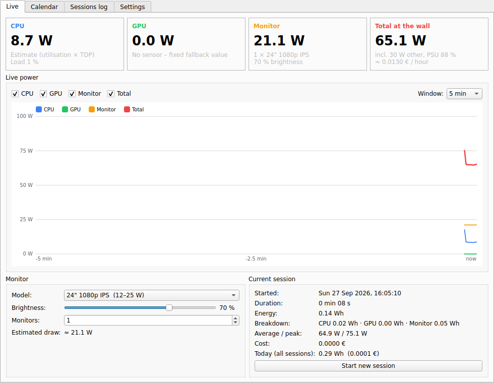

# Power Meter

A small Qt/C++ desktop app that runs in the system tray and measures how much power
your computer uses in **watts**, in real time. It logs every session and shows your
daily energy use on a calendar.



## Features

- **Live readout** of CPU, GPU, monitor and total power at the wall, with a live graph
  (1 min / 5 min / 15 min / 1 h window, and each line can be turned on or off).
- **Monitor model selector** with presets (laptop panel up to a 49" super-ultrawide, OLED,
  or custom), a **brightness slider** and a **number of monitors** setting.
- **Sessions**: each app launch is one session. You can also start a new one at any time.
  Each session records duration, energy (CPU / GPU / monitor / total), average and peak
  watts, and cost.
- **Stays running**: closing the window hides it to the tray. The tray icon shows the current
  total watts, and its tooltip gives the breakdown.
- **Calendar**: each day is shaded from green to red by the energy used that day and labelled
  with its kWh. Click a day to see its sessions, energy and cost. The monthly total is shown
  below the calendar.
- **Sessions log**: a table of all sessions, with CSV export and delete.
- **Options**: electricity price and currency, PSU efficiency, power for the rest of the
  system (motherboard, RAM, disks, fans), sample interval, always-on-top and start minimized.

Data is saved to an SQLite database: one row per session plus one averaged sample per minute.
The database lives in the app data folder (`~/.local/share/PowerMeter/PowerMeter/` on Linux)
and its path is shown in the Settings tab. It is updated every minute, so a crash loses at
most one minute of data. Time spent suspended is not counted.

## Where the numbers come from

| Part    | Real sensor (preferred)                                                       | Fallback                                    |
|---------|-------------------------------------------------------------------------------|---------------------------------------------|
| CPU     | Linux RAPL `/sys/class/powercap/intel-rapl:*` (Intel and Zen 2+ AMD), `zenpower` | Estimate: idle W + (TDP − idle) × CPU load  |
| GPU     | NVIDIA via NVML (Linux and Windows, loaded at runtime), AMD `amdgpu` hwmon, Intel Arc hwmon energy, Intel iGPU via RAPL *uncore* | Fixed value you choose in Settings |
| Monitor | —                                                                             | Model preset × brightness × number of monitors |
| Total   | (CPU + GPU + other) ÷ PSU efficiency + monitor                                 |                                             |

The CPU and GPU cards show which source is in use. If a card says *Estimate* or
*fallback*, that number is approximate.

### Linux: allow reading the CPU energy counters

Since Linux 5.10, `energy_uj` can only be read by root. The app shows a warning if that
blocks it. You can fix it for the current boot with:

```sh
sudo chmod o+r /sys/class/powercap/intel-rapl:*/energy_uj /sys/class/powercap/intel-rapl:*/*/energy_uj
```

To make it permanent, add a udev rule, e.g. `/etc/udev/rules.d/99-powercap.rules`:

```
SUBSYSTEM=="powercap", ACTION=="add", RUN+="/bin/chmod o+r /sys%p/energy_uj"
```

### Windows

GPU power is measured through NVML on NVIDIA cards (`nvml.dll` comes with the driver).
Windows gives normal programs no way to read CPU package power, so the CPU value is an
estimate based on CPU load. Set your CPU's TDP in Settings to make it more accurate.

## Build

Requirements: CMake ≥ 3.16, a C++17 compiler, and Qt 6 (or Qt 5.15) with the *Widgets* and
*Sql* modules, plus the SQLite driver.

```sh
# Debian/Ubuntu
sudo apt install cmake g++ qt6-base-dev libqt6sql6-sqlite

cmake -S . -B build -DCMAKE_BUILD_TYPE=Release
cmake --build build -j
./build/powermeter
```

On Windows or macOS, open `CMakeLists.txt` in Qt Creator, or run CMake with
`-DCMAKE_PREFIX_PATH=<path-to-Qt>`.

To start measuring automatically at login, add `powermeter` to your desktop's autostart
programs and turn on **Start minimized to tray** in Settings.

## Project layout

```
src/main.cpp            single-instance lock, opens the database, shows the window
src/mainwindow.*        UI: Live, Calendar, Sessions log and Settings tabs, tray icon, session logic
src/powermonitor.*      reads the hardware sensors (RAPL, NVML, hwmon) and the estimates
src/sessionstore.*      SQLite storage for sessions and per-minute samples
src/livegraph.*         real-time line chart drawn with QPainter
src/energycalendar.*    QCalendarWidget that shades each day by energy used
src/settings.*          settings saved with QSettings, monitor presets
```
